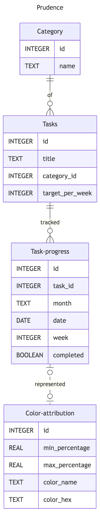

## Scope

Prudence tracks self-development. The anxiety that characterizes modern life has made people become mentally scattered which substantially affects their wellbeing and quality of life. The database is built with the intent to cultivate organization, discipline and structure through self-assigned tasks by the user's choice, preferences and/or hobbies. Often we cannot find time anymore to pursue our interests and that of course leaves us upset and at the hands of our electronic devices which only exacerbate our mental health. The design is simple in order not to cause overwhelm: each month you will set 4 categories of tasks of your choice that you aim to carry out throughout that month by choosing the frequency of each of those tasks and the days to do them. To make this fun and engaging for the user, the progress measured through percentage ranges has 5 gradient shades of purple attributed to each respective range. The user can unlock the last shade since the first month or it can gradually arrive there. That is not the point though; Prudence works with the idea that it takes 30 days to create a habit.

The scope of my database includes the following:

1. **Category**: to have a clear organization of the type of tasks you focus on each month.
2. **Tasks**: list of the tasks you want to carry out and a target per week where you choose how you wanna stretch them out.
3. **Time**: the month, the days and the weeks to log your entries.
4. **Daily log** whether the task was completed or not.
5. **Monthly and weekly progress** in percentage.
6. **Percentage progress** illustrated with a color attribution system.

Outside the scope of my database are the following:

1. This is designed for a single user and it doesn't use log-in or authentication factors.
2. You can't add notes or reminders (e.g. if you can't do the last task of the day because you have a headache).
3. Social functions (intentional though because this is between you and you strictly).
4. Log entry timestamp.
5. No streaks (intentional once again because it can turn into an obligation).

## Functional Requirements

A user can:

1. Log tasks, categorize them in 4 types and set them daily and weekly.
2. Check how many days left to complete a task.
3. Check overall progress in percentage.
4. Check overall progress through color gradient.
5. Add, update, delete tasks.
6. Filter by category or by date/date range.
7. Track monthly progress through percentage and color attribution.

A user cannot:

1. Share progress via social media.
2. Add notes, stickers, reminders, etc.
3. Set an alarm to carry out the task.
4. Track by daily streaks.
5. Postpone the task/s to the next month.
6. Mark certain tasks with higher priority than the rest.

## Representation

### Entities

#### Category

Represents: Categorizing the tasks the user aims to do throughout the month.

| Column | Type    | Constraint      | Reason                                     |
|--------|---------|-----------------|--------------------------------------------|
| `id`   | INTEGER | PRIMARY KEY     | Unique identifier                          |
| `name` | TEXT    | NOT NULL UNIQUE | String, describes the category with a name |

**Relationships:** `id` is referenced by `tasks(category_id)`.

---

#### Tasks

Represents: The list of activities the user wants to carry out throughout the month.

| Column            | Type    | Constraint            | Reason                                      |
|-------------------|---------|-----------------------|---------------------------------------------|
| `id`              | INTEGER | PRIMARY KEY           | Unique identifier                           |
| `title`           | TEXT    | NOT NULL              | String, describes the task                  |
| `category_id`     | INTEGER | NOT NULL, FOREIGN KEY | Relates to category, cannot be empty        |
| `target_per_week` | INTEGER | NOT NULL              | Whole number, min 1 day max 7 days per week |

**Relationships:** `category_id` references `category(id)`. `id` is referenced by `task_progress(task_id)`.

---

#### Task Progress

Represents: The daily log of your tasks, whether a task was completed or not, set to a specific date, week and month.

| Column      | Type    | Constraint            | Reason                                        |
|-------------|---------|-----------------------|-----------------------------------------------|
| `id`        | INTEGER | PRIMARY KEY           | Unique identifier                             |
| `task_id`   | INTEGER | NOT NULL, FOREIGN KEY | Related to tasks, cannot be empty             |
| `month`     | TEXT    | NOT NULL, DEFAULT     | Tracks the month, string                      |
| `date`      | DATE    | NOT NULL, DEFAULT     | Tracks the days, default to current date      |
| `week`      | INTEGER | NOT NULL              | Tracks the 4 weeks of the month, whole number |
| `completed` | BOOLEAN | NOT NULL              | 1 = done, 0 = yet                             |

**Relationships:** `task_id` references `tasks(id)`. `ON DELETE CASCADE`: when deleting a task, all its log entries are deleted as well.

---

#### Color Attribution

Represents: Each percentage range is attributed to one of the five shades of purple. The shades become stronger jumping in range for then to achieve the final shade that is Violet. 0 – 24.99 = Lavender, 25 – 49.99 = Lilac, 50 – 74.99 = Mauve, 75 – 99.99 = Amethyst, 100 – 100 = Violet.

| Column           | Type    | Constraint  | Reason                            |
|------------------|---------|-------------|-----------------------------------|
| `id`             | INTEGER | PRIMARY KEY | Unique identifier                 |
| `min_percentage` | REAL    | NOT NULL    | Ranges use decimals               |
| `max_percentage` | REAL    | NOT NULL    | Ranges use decimals               |
| `color_name`     | TEXT    | NOT NULL    | Name of the purple shade, string  |
| `color_hex`      | TEXT    | NOT NULL    | The hex code of the color, string |

**Relationships:** Related to `task_progress` at query time via `BETWEEN min_percentage AND max_percentage`.


### Relationships


The diagram represents four entities: `category`, `tasks`, `task_progress` and `color_attribution`. Firstly you choose 4 categories of tasks/activities you decide to achieve and focus on for said month. After choosing the categories, you choose the tasks, hence each category has a list of tasks which are placed throughout the month in accordance with your objectives and plans. Each task that you do is counted in your task progress entity. All tasks amount to 100% by the end of the month. `task_progress` is an entity that is measured in percentage and is represented visually by 5 shades of color purple. Each of these 5 shades are attributed to a percentage range amounting to 25% each. The `color_attribution` entity is a range lookup table connected via query time through the `BETWEEN` clause.

`category` to `tasks` represents a one-to-many relationship meaning that a category can have at least one task but they can have many tasks as well. A task can only be part of one category. The `category_id` foreign key in the `tasks` table referencing `category(id)` enforces this relationship.

`tasks` to `task_progress` represents a one-to-many relationship. This means that the one task or the many tasks that you write on the tracker has/have their respective progress. On the other hand, a task progress is solely related to one or one of the many tasks. For this reason we have the `task_id` foreign key referencing `tasks(id)`. In this relationship we have used the `ON DELETE CASCADE` clause so when deleting a task, all its log entries are automatically deleted as well.

The last relationship is `task_progress` to `color_attribution` which is a different type of relationship because of the fact that `color_attribution` is a lookup table connected via query time through the `BETWEEN` clause. For this reason we have no foreign key present and the relationship has a dashed line in the ER diagram.


## Optimizations
I created the following indexes:

​```sql
CREATE INDEX `tasks_category_index`
ON `tasks`(`category_id`);

CREATE INDEX `task_progress_week_index`
ON `task_progress`(`week`);

CREATE INDEX `task_progress_date_index`
ON `task_progress`(`date`);

CREATE INDEX `task_progress_month_index`
ON `task_progress`(`month`);
​```

The reason I created these specifically is just a matter of practicality and frequency: since Prudence is a daily/weekly/monthly tracker, the user necessitates a clear picture where their progress stands, how it looks like and what is it composed of.

Similarly, the view I created works for the same abovementioned reason. The user will want to use the color attribution feature to check their progress by shade and not by %.

​```sql
CREATE VIEW `monthly_progress` AS
SELECT `color_name`, `color_hex`, ROUND(SUM(`completed`) * 100.0 / SUM(`target_per_week` * 4), 1) AS `progress_pc`
FROM `task_progress`
JOIN `tasks` ON `task_progress`.`task_id` = `tasks`.`id`
JOIN `color_attribution` ON ROUND(SUM(`completed`) * 100.0 / SUM(`target_per_week` * 4), 1) BETWEEN `min_percentage` AND `max_percentage`
GROUP BY `month`;
​```

## Limitations

The database may not be prepared for very thorough or meticulous calculations like for example a MLB or ESPN advanced database can do. It is a simple design with some features within the confines of what SQLite allows. For example, ESPN can retrieve which player has the most triple-doubles in playoffs history of a specific franchise since which was the last year the previous player broke the record.

Firstly, it is small in size. In this case there might be a limit on how long you can keep this tracker, meaning until how many months you can use it.

Secondly, there can be the need to implement post-creation changes but the `ALTER TABLE` functions are limited. For example, if you want to make it more dynamic, this means you have to make the changes in the schema and you have to make sure the changes do not cause problems for the values in the database to be inserted in the model.

As I mentioned previously this is single user only. There is no need to create an account, to enter a password, to have authentication factors.
